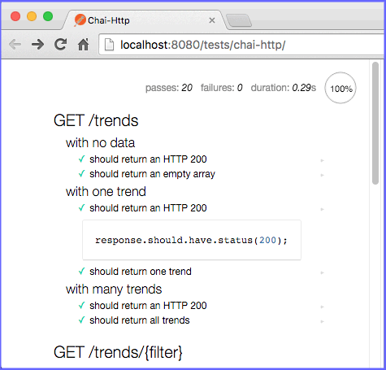
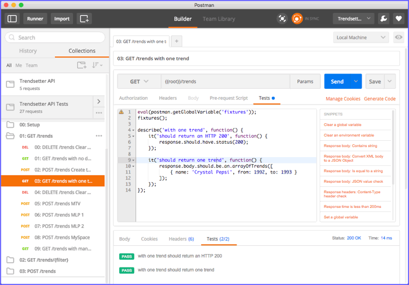
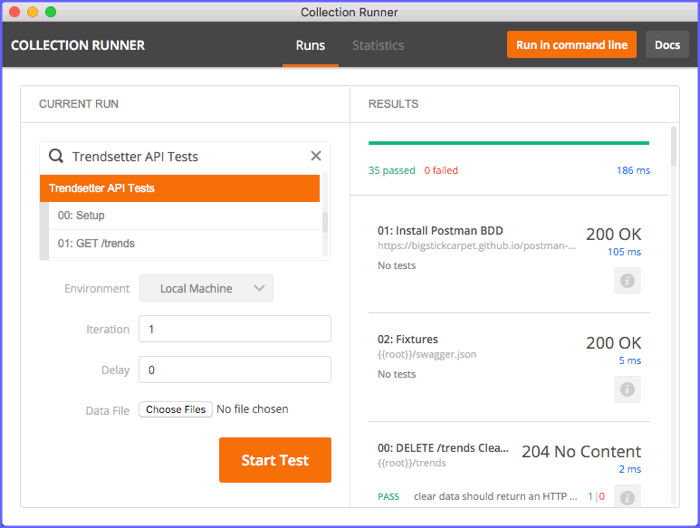

Super-Powered API Testing
============================
#### How and why to test your API

This code repository accompanies a presentation I gave in Austin, Texas on February 4th, 2016.  Video of the presentation is [available on YouTube](https://youtu.be/bhrg-7f2e8k?t=1800), and the slide deck is [right here](https://docs.google.com/presentation/d/1oZknCWA6M186Pmfx43LVmWwdQvaqFhZLXX-_5lZkpQw/edit?usp=sharing).

- **[What's in this repo?](#whats-in-this-repo)**

- **[Installation](#installation)**

- **[Running the tests in a CLI](#running-the-tests-in-a-cli)**

- **[Running the tests in a GUI](#running-the-tests-in-a-gui)**
    - [in your IDE](#option-1-run-them-in-your-ide)
    - [in a web browser](#option-2-run-them-in-a-web-browser)
    - [in Postman](#option-3-run-them-in-postman)
    - [in the Postman Runner](#option-4-run-them-in-the-postman-runner)

- **[Debugging the tests](#debugging-the-tests)**
    - [Node Inspector](#option-1-node-inspector)
    - [Web browser](#option-2-web-browser)
    - [IDE](#option-3-ide)
    - [Postman](#option-4-postman)

What's in this repo?
--------------------------
This project contains a [sample REST API](https://documenter.getpostman.com/go?view=Y29sbGVjdGlvbl9pZD01OTE4ZjM2MS0zMjMwLWYzOTUtNzVkNC1kYzFiMTYwNGNhNDYmb3duZXI9MzA1NzU0JnVzZXJfaWQ9MzA1NzU0JmFjY2Vzc190b2tlbj1mZDY2YzNjYmUyZTM1ZTk1ODc1YSZzeW5jX2Vudj1wcmVtaXVt), and a full suites of accompanying tests.  The exact same test suite is repeated four times, in four different API test frameworks.  The intent is to demonstrate the difference between the various frameworks, such as syntax, features, and ease-of-use.

The following API test frameworks are covered:

- [Chai HTTP](https://github.com/chaijs/chai-http)
- [Chakram](https://github.com/dareid/chakram)
- [Postman](http://getpostman.com)
- [Supertest](https://github.com/visionmedia/supertest)

Installation
--------------------------

1. __Install Node.js__ 
To run the demo, you'll need to have [Node.js 4.0 or greater](https://nodejs.org/en/) installed on your system.

2. __Clone this repo__ 
`git clone https://github.com/bigstickcarpet/super-powered-api-testing.git`

3. __Install dependencies__ 
`npm install`

Running the tests in a CLI
--------------------------
The [`package.json`](package.json) file includes several scripts to make it easy for you to run the tests from a command-line.  Just `cd` to the root directory of the project, and then run any of the following commands:

| command                | description
|------------------------|------------------------------------
| `npm run chakram`      | Run the [Chakram](tests/chakram) test suite*
| `npm run supertest`    | Run the [SuperTest](tests/supertest) test suite*
| `npm run chai-http`    | Run the [Chai-HTTP](tests/chai-http) test suite*
| `npm run newman`       | Run the [Postman](tests/newman) test suite in [Newman](https://www.npmjs.com/package/newman)*
| `npm start`            | Start a local web server running the [sample REST API](https://documenter.getpostman.com/go?view=Y29sbGVjdGlvbl9pZD01OTE4ZjM2MS0zMjMwLWYzOTUtNzVkNC1kYzFiMTYwNGNhNDYmb3duZXI9MzA1NzU0JnVzZXJfaWQ9MzA1NzU0JmFjY2Vzc190b2tlbj1mZDY2YzNjYmUyZTM1ZTk1ODc1YSZzeW5jX2Vudj1wcmVtaXVt)
| `npm stop`             | Stop the web server
| `npm restart`          | Stop the web server (if it's running), and then start it

> **Note:**  Commands marked with an asterisk (*) rely on the web server running in the background.  On Mac and Linux systems, the web server will automatically be started beforehand and stopped afterward.  On Windows systems, you need to run the web server yourself in a separate console window via the `npm start` command

Running the tests in a GUI
--------------------------
There are several options for running the tests in various GUIs.  However, you'll need to start the local web server first, otherwise none of the tests will work.  You can do this by running the `npm start` script mentioned above.  When you're done, you can use `npm stop` to stop the server.  And you can use `npm restart` at any time to stop-and-start the server, which is an easy way to reset all of the data.

#### Option 1: Run them in your IDE
Supertest, Chakram, and Chai-HTTP all use [Mocha](https://mochajs.org/) as their test-runner.  Many popular IDEs and text editors have built-in support for Mocha, so you can easily run your tests with the press of a button and see the results right in your IDE.

  - [How to use Mocha in WebStorm](https://www.youtube.com/watch?v=4mKiGkokyx8))
  - [How to use Mocha in Visual Studio](https://github.com/Microsoft/nodejstools/wiki/Test-Explorer)
  - [Mocha plug-ins for Atom](https://atom.io/packages/search?q=mocha)

#### Option 2: Run them in a web browser
Chai-HTTP is the only framework that allows you to run your tests in a web browser. This is a _fantastic_ feature, so definitely try it out.  You can even run your tests in mobile browsers, such as iOS, Android, and Window Phone.

Start the local web server (using the `npm start` command above), and then browse to [http://localhost:8080/tests/chai-http](http://localhost:8080/tests/chai-http/).

> **Bonus!** You can click on any test to see the code for that test.

> **Bonus!** You can click the arrow next to any test to run _just_ that test. This is great for debugging!

#### Option 3: Run them in Postman
To run the Postman tests, just import the [`tests.json`](https://raw.githubusercontent.com/BigstickCarpet/super-powered-api-testing/master/tests/newman/tests.json) and [`localhost-environment.json`](https://raw.githubusercontent.com/BigstickCarpet/super-powered-api-testing/master/tests/newman/localhost-environment.json) files into Postman. (you can do this by clicking the "_import_" button in the header bar)

> **Note:** The `localhost-environment.json` file creates a [Postman environment](http://www.getpostman.com/docs/environments) that points to the local web server ([http://localhost:8080](http://localhost:8080)). Be sure to select this environment from the drop-down list in Postman, otherwise none of the requests will know where to go.

> **Note:** Make sure you run the two requests in the `00: Setup` folder first.  These requests download [Postman BDD](https://github.com/BigstickCarpet/postman-bdd) and add some test fixtures that are needed by all of the other tests.

#### Option 4: Run them in the Postman Runner
The normal Postman UI allows you to test individual requests one-by-one and see the results.  That's great for debugging a specific endpoint or scenario, but if you want to run _all_ of the tests, then you'll want to use the Postman Collection Runner.  To do this, click the "_Runner_" button in the header bar.

Select the collection you want to run (in this case, the "_Trendsetter API Tests_" collection), and select an environment (in this case, the "_Local Machine_" environment).  Then click the "_Start Test_" button.  You'll see the test results on the right-hand side, as well as a pass/fail summary at the top.  You can also click the "info" icon for any request to see detailed test results for that request.

Debugging the tests
--------------------------

#### Option 1: Node Inspector
If you're running the tests on the command-line, then you can use [`node-inspector`](https://www.npmjs.com/package/node-inspector) to debug them.  Node Inpector is pretty cool because it allows you to debug Node.js code using your web browser's built-in developers tools - complete with breakpoints, stepping, variable inspection, etc!

### Option 2: Web Browser
If you're running the tests in a web browser, then you can use your browser's built-in developer tools.  On Windows, press `F12` to open the developer tools.  On Mac, press `cmd`+`alt`+`i`.

### Option 3: IDE
Most IDEs support Node.js debugging, including Visual Studio, Visual Studio Code, WebStorm, and Atom.  Just follow your IDE's normal process for debugging code.

### Option 4: Postman
Postman is actually an HTML-based application, running in an embedded Chrome browser instance.  So you can follow the same procedure as _Option 2_ above.  `F12` on Windows.  `cmd`+`alt`+`i` on Mac.

> **Note:** You may need to [enable debugging for packed apps](http://blog.getpostman.com/2014/01/27/enabling-chrome-developer-tools-inside-postman/) first

License
--------------------------
Super-Powered API Testing is 100% free and open-source, under the [MIT license](LICENSE). Use it however you want.
